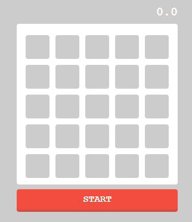
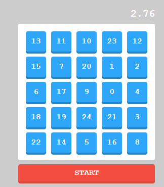

# 数字タッチゲーム

Reactの基礎を学ぶために作成する、フロントエンド研修用の数字タッチゲームアプリです。

## 主な機能

- カウントアップ
- 0~24の整数を5\*5盤面にランダム配置
- 数字順クリック
- 最後の数字（24）押下時にカウントストップ
- リセット

## 参考教材

[JavaScript(React)で数字タッチゲームを作ろう（ドットインストール）](https://dotinstall.com/lessons/numbers_js_v6)
[sample](https://samples.dotinstall.com/s/numbers_js_v6/51718/MyNumbersGame/index.html)

## 完成イメージ

